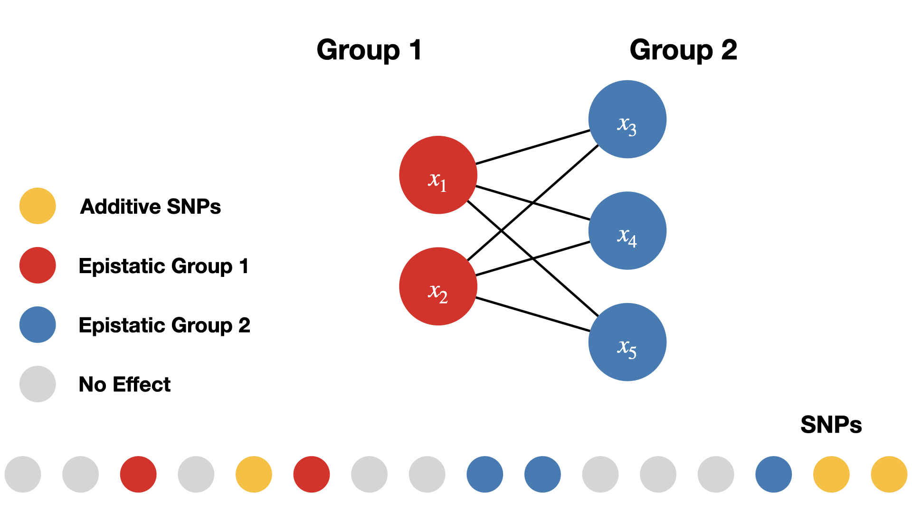

```{r setup, include = FALSE}
knitr::opts_chunk$set(
  collapse = TRUE,
  comment = "#",
  fig.width=7,
  fig.height=5
)
library(knitr)
```
```{r load_dependencies, message=FALSE}
library(mvMAPIT)
```
Data are simulated sample genotypes with $p$ single nucleotide polymorphisms (SNPs) and $n$ samples togeter with some quantitative traits.

# Simulate Genotypes
Create a matrix that contains underdetermined genotype data of random minor allele counts encoded as 0, 1, and 2.
We control the minor allele frequency `maf` to be greater than 0.05.
```{r simulate_genotypes, eval = FALSE}
set.seed(1234)

n_samples <- 2938
n_snp <- 5747

maf <- 0.05 + 0.45 * runif(n_snp)
random_minor_allele_counts   <- (runif(n_samples * n_snp) < maf) + (runif(n_samples * n_snp) < maf)
genotype_data <- matrix(random_minor_allele_counts,
  nrow = n_samples,
  ncol = n_snp,
  byrow = TRUE,
)

sample_names <- seq_len(n_samples) %>% sprintf(fmt = "id%04d")
snp_names <- seq_len(n_snp) %>% sprintf(fmt = "snp%04d")

colnames(genotype_data) <- snp_names
rownames(genotype_data) <- sample_names
```

The entries in the genotype matrix are:

* $0$ if the genotype is homozygous in the reference allele,
* $1$ if both, the reference allele and the alternative allele are present,
* $2$ if the genotype is homozygous in the alternative allele.

An example genotype matrix could look like this:

|Sample|SNP 1|SNP 2|...|SNP p|
|------|-----|-----|---|-----|
|  1   |  0  |  1  |...|  2  |
|  2   |  1  |  0  |...|  0  |
| ...  | ... | ... |...|  1  |
|  n   |  2  |  2  |...|  1  |

# Simulate Traits
The simulated traits will be based on the genotype data simulated in the previous
step. Simulations are implemented in the function `simulate_traits`.
The causal SNPs as well as their effect sizes will be drawn at random.
For simulating traits, we need to control the following simulation parameters.

Simulation Parameters:

1. `n`: number of samples
1. `p`: number of SNPs or variants
1. `d`: number of traits
1. `PVE`: phenotypic variance explained/broad-sense heritability ($H^2$)
1. `rho`: portion of $H^2$ that is contributed by the marginal (additive) effects
1. Number of SNPs that are causing variation in the trait:
    * `n_causal`: total number of SNPs with any effects on traits.
    * `n_trait_specific`: number of epistatic SNPs that affect a single trait.
    * `n_pleiotropic`: number of epistatic SNPs that affect all traits.
    * `group_ratio_pleiotropic`: ratio by which to split the epistatic SNPs into groups, e.g. 1:1, 1:3.
1. `epistatic_correlation`: correlation between the epistatic effects.


```{r simulation_parameters, eval = FALSE}
seed <- 67132
d <- 2
PVE <- 0.6
rho <- 0.2
n_causal <- 1000
n_trait_specific <- 0
n_pleiotropic <- 10
group_ratio_pleiotropic <- 1
epistatic_correlation <- 0.9
maf <- 0.05
simulated_data <- simulate_traits(
    genotype_data,
    n_causal = n_causal,
    n_trait_specific = n_trait_specific,
    n_pleiotropic = n_pleiotropic,
    d = d,
    H2 = PVE,
    rho = rho,
    epistatic_correlation = epistatic_correlation,
    group_ratio_pleiotropic = group_ratio_pleiotropic,
    maf_threshold = maf,
    seed = seed
)
```


We randomly choose causal variants that are split into three groups:

1. set of additive SNPs without interactions,
1. group 1 of interaction SNPs, and
1. group 2 of interaction SNPs.

In the simulations carried out in this study, SNPs interact between sets. SNPs in the first group interact with SNPs in the second group, but do not interact with variants in their own group, and vice versa. One may view the SNPs in the first set as the “hubs” in an interaction map. We are reminded that interaction (epistatic) effects are different from additive effects.
The following image illustrates the simulation of interactions.


{width=80%}


> **NOTE**: All causal SNPs in both the second and third groups have additive effects and are involved in pairwise interactions, while causal SNPs in the first set only have additive effects.

# Details on Simulating Pairwise Epistasis

The general simulation scheme for interactions follows the methods outlined in
Crawford et al. (2017)\cite{crawford_detecting_2017}. For the data representing
the null hypothesis of no epistasis present, 1000 SNPs without rare variants are
sampled from the genotype data. The effect sizes of the causal SNPs then are
sampled independently from a multivariate normal distribution according to equation
\ref{eq:null_simulations_beta}.

\begin{equation}\label{eq:null_simulations_beta}
    \mathbf{b}_i \sim \mathcal{N}_{d}\left(0, \mathbf{U}\right)
\end{equation}

As parameter of the simulations, $\mathbf{U}$ describes the covariance
between the additive effects of the causal SNPs on the $d$ different traits. The effects of all
other SNPs are set to zero.

In order to simulate pleiotropy, the number of desired pleiotropic SNPs is
sampled from the set of causal SNPs. These SNPs are then included in simulating
interactions for every trait. Additionally, trait specific SNPs are sampled
independently for each trait from the causal SNPs without the pleiotropic SNPs.

The interactions are modeled by selecting the number of desired SNPs that have
non-zero pairwise interaction effects. These SNPs then are split into two
groups. Each SNP from one group is simulated to interact with each SNP of the
other group but not with any SNP within the same group that it was assigned to.
This results in $n_1 \cdot n_2$ epistatic interactions, with $n_i$ the number of
SNPs in group i. For all these
interactions, random effects are sampled from the multivariate normal distribution
given in \ref{eq:simulations_alpha}.

\begin{equation}\label{eq:simulations_alpha}
    \mathbf{a}_i \sim \mathcal{N}_{d}\left(0, \mathbf{V}\right)
\end{equation}

Analogously, $\mathbf{V}$ is the covariance
between the pariwise epistatic effects of the causal SNPs on the $d$ different traits.
The portion of the variance $\mathbf{E}$ that is not due to heritable effects
is simulated as multivariate normal with no correlation. The effects of the SNPs
and interactions are collected in matrices $\mathbf{A}$ and $\mathbf{B}$. The matrices
$\mathbf{X}$ and $\mathbf{W}$ contain the genotype data of the causal SNPs and interactions.
With these effects, the phenotypes then are simulated according to equation
\ref{eq:simulation_mapit}.

\begin{equation}\label{eq:simulation_mapit}
    \mathbf{Y} = \mathbf{X}\mathbf{B} + \mathbf{W}\mathbf{A} + \mathbf{E}
\end{equation}


For each trait independently, the variance components are scaled such that
the variance can be partitioned according to equation
\ref{eq:simulation_var_comp}.

\begin{align}\label{eq:simulation_var_comp}
    \mathbf{Y} &= \mathbf{Y}_{X} + \mathbf{Y}_{W} + \mathbf{E} \\
    \mathrm{var}(\mathbf{Y}) &= \mathrm{var}(\mathbf{Y}_{X}) +
                            \mathrm{var}(\mathbf{Y}_{W}) +
                            \mathrm{var}(\mathbf{E}) \\
                         &= \rho \cdot H^2 + (1 - \rho) \cdot H^2 + (1 - H^2) \\
                         &= 1
\end{align}